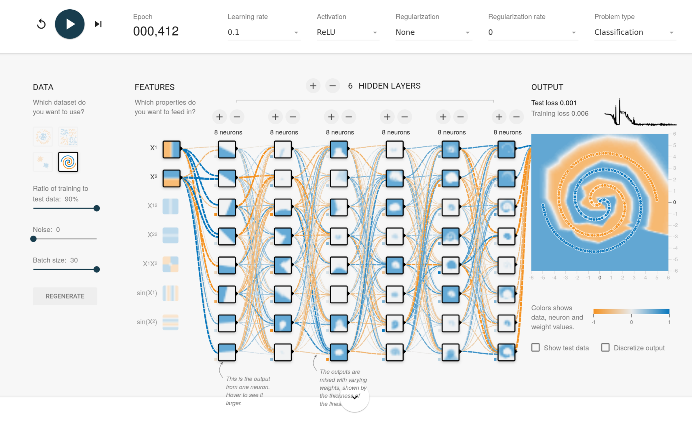
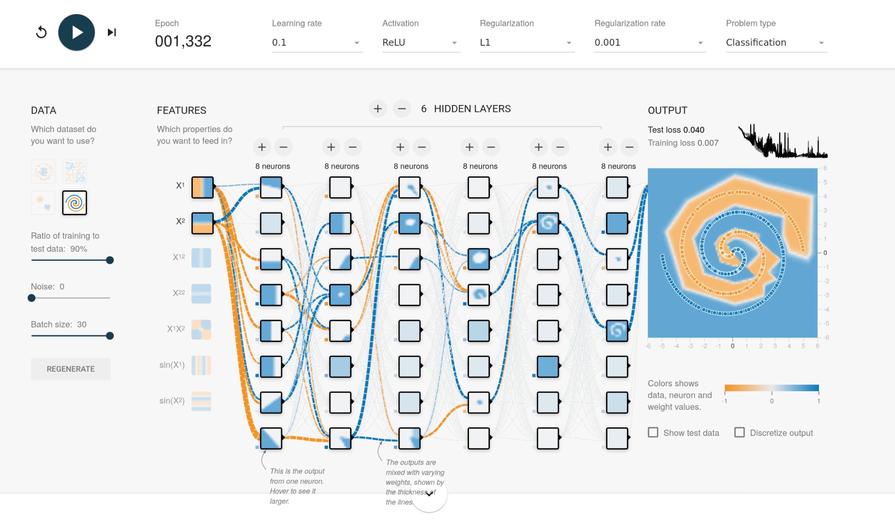
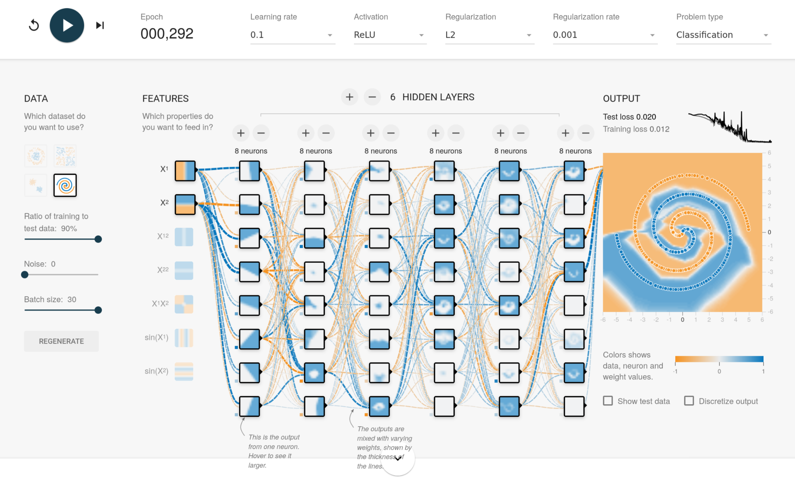

# 2 Bonus: Training of an MLP

## (a)

 

## (b)

We expect both variants to have smaller activations on average. Additionally, we 
expect L1 regularization to lead to sparse activations.

 

 

We observe sparse regularizations in L1 case, but with L2 the difference with 
the unregularized network is minimal.
